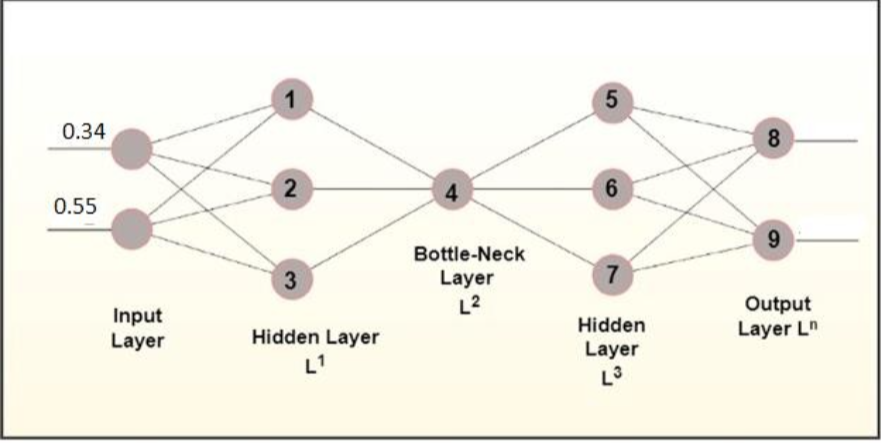

# Assignment 1 – Recent Advances in Generative AI  
**Course:** Fall 2025  
**Total Marks:** 100  
**Due Date:** 3rd October  

---

## Overview
This assignment focuses on understanding **autoencoders** and **variational autoencoders (VAEs)**, their architectures, and their mathematical foundations.  
You’ll explore how these models work, implement simplified versions, and analyze their loss functions.

---

## Tasks

### 1. Reflective Summary on Variational Autoencoders (20 Points)
- Watch the following lecture: [Variational Autoencoder (YouTube)](https://www.youtube.com/watch?v=9zKuYvjFFS8)  
- Write a **1-page reflective summary** in your own words.  
- Clearly explain the difference between **VAE** and **β-VAE**.  
- Include and describe formulas for all **loss functions** involved.  
- **Formatting:** 1 page, *Times New Roman*, size 11, **no line spacing**.

---

### 2. Four-Layer Autoencoder Architecture (30 Points)
- Consider a **4-layer autoencoder** where:
  - Each node applies **ReLU** non-linearity.
  - **Bias units** are **not considered**.
- Perform a **forward pass** of the network using the given inputs.  
- Follow the structure discussed in lectures, but note that **input values are changed**.  

---

### 3. Variational Autoencoder Implementation (30 Points)
- Repeat Task 2 using a **Variational Autoencoder (VAE)**.  
- Initialize the **weights before mean and standard deviation** to **0.5**.  
- Perform only the **forward pass**.  
- Discuss what is needed during the **backward pass**, including:
  - Necessary **derivatives**.
  - Computation of **weight updates** before mean and standard deviation.

---

### 4. Example Exercises (20 Points)
- Complete **Examples 2-1 to 2.16** as provided in the course material.  

---

## Deliverables
- A single **PDF or DOCX** file containing:
  - Reflective summary.
  - Calculations and discussion for the autoencoder and VAE.
  - Completed example exercises.

---

## Submission
Submit your final file via the course LMS or according to instructor instructions by **October 3rd, 2025**.

---

## Evaluation
| Component | Marks |
|------------|-------|
| Reflective Summary | 20 |
| Autoencoder Architecture | 30 |
| Variational Autoencoder | 30 |
| Example Exercises | 20 |
| **Total** | **100** |

---

**Prepared for:** *Generative AI – Fall 2025*  
**Institution:** *FAST NUCES*  
